# Тестовое задание - вариант 3


## Задание 1
Генератор синуса на частоте [0; 50]
``` python
def generator_sin(f, fs):
    t_total =  1  # Общее время для отображения 

    t = np.arange(0, t_total, 1/fs)
    y = np.sin(2 * np.pi * f * t)

    return y, t
```

``` python

```
Для примера возьмем частоту f = 10 Гц при частоте дискретизации fs = 100 Гц, по оси времени возьмем 1 сек.  
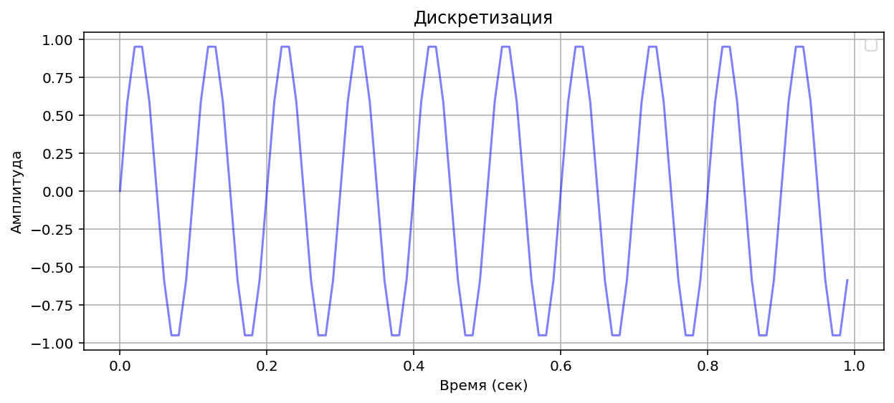
Посмотрим дискретные значения:
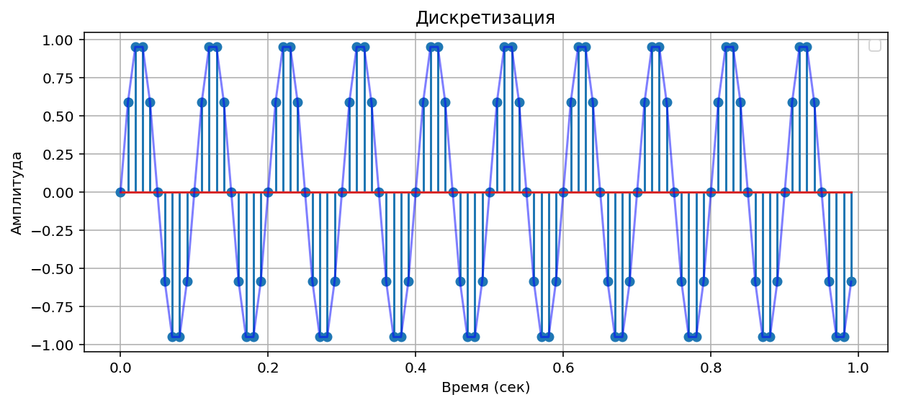
А также посмотрим спектр
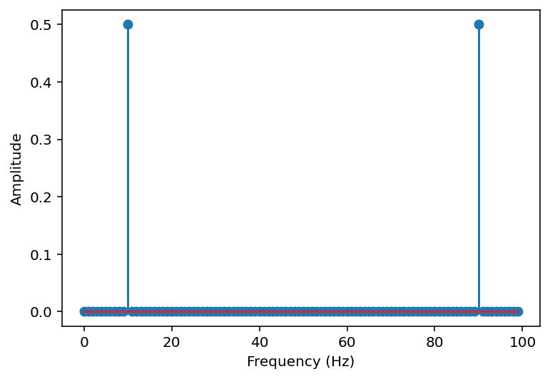


## Задание 2 - Интерполяция

Разделим процесс интерполяции на 2 этапа:

1. Введение нулей в исходную последовательность
``` python

def Upsampling(x, L):
    n = len(x)
    m = L*n
    y = np.zeros(m)
    x_i = 0
    for i in range(m):
        if i % L == 0:
            y[i] = x[x_i]
            x_i += 1

    return y
```
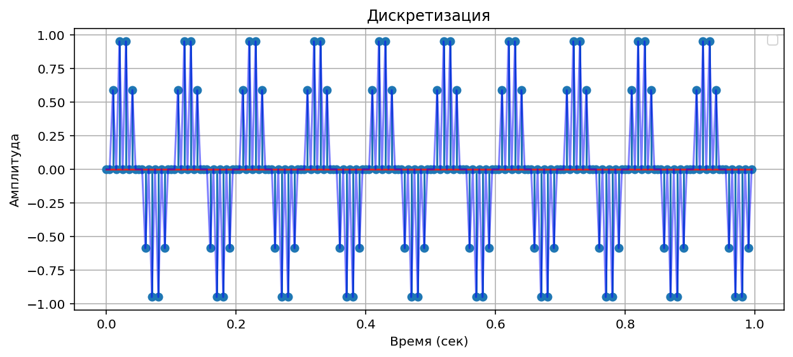
результирующий спектр
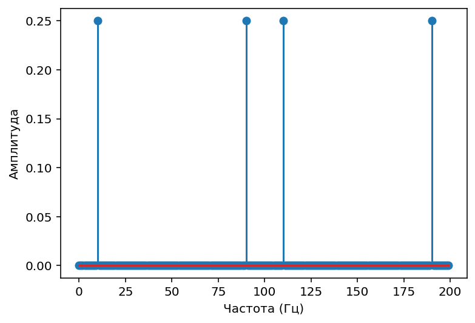

2.Интерполирующий фильтр
Благодаря цифровому фильтру убираем на сиrнале наложившиеся зеркальные компоненты.
``` python
## Использую Окно Хэмминга чтобы избежать резкого обрезания sinc-функции
def Hamming_window(k, N):
    return 0.54 + 0.46 * np.cos(np.pi * k / N)

def FIR_lowpass(k, L, N):
    return np.sinc(k / L) * Hamming_window(k, N)

def filtering_signal(x, L):
    N = 2 * L
    m = len(x)
    # m = n * L
    y = np.zeros(m)

    for i in range(m):
        for k in range(-N, N + 1):
            if (i - k) >= 0 and (i-k) < m:
                h = FIR_lowpass(k, L, N)                
                y[i] += h * x[i - k]

    return y
```
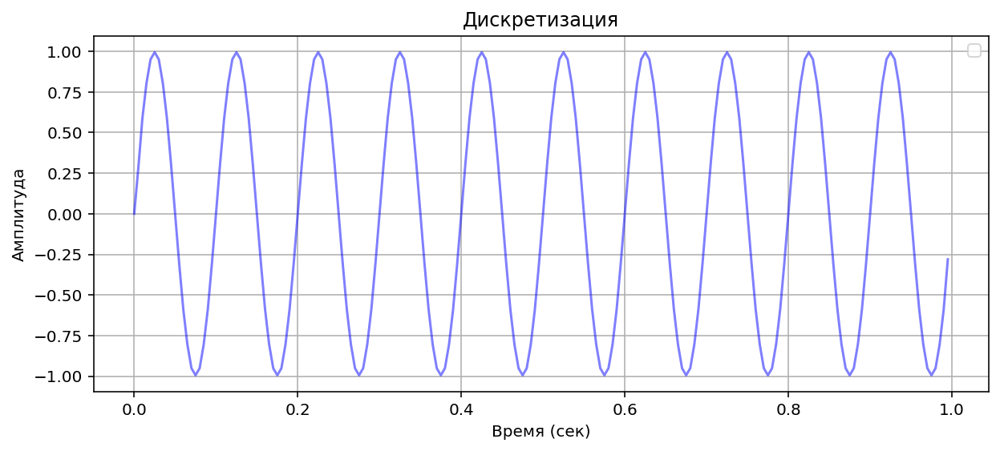
Посмотрим дискретные значения:
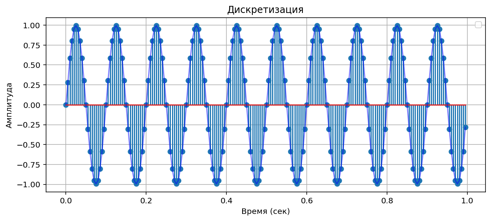

Окончательный спектр интерполированной последовательности.
Видим повышение частоты дискретизации
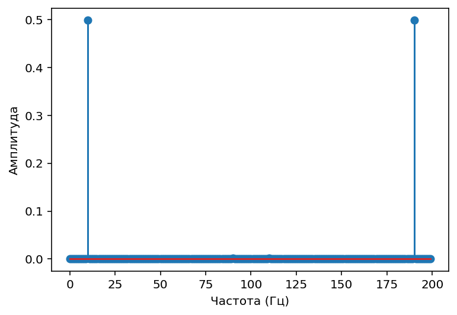


## Задание 3 - Децимация (Понижение частоты дискретизации)
Децимация происходит по аналогии с интерполяцией, только в данном случае мы берем в результирующую сумму лиш каждый M отсчет
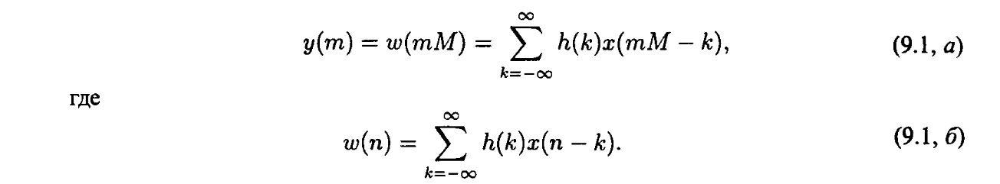

Получившийся после прореживания сигнал

Посмотрим дискретные значения:
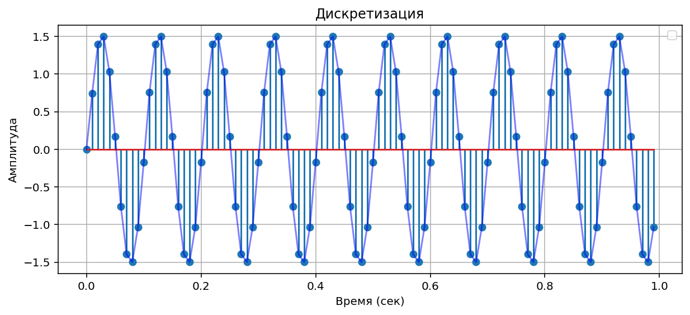
А также посмотрим спектр (Как видим прежюю частоту 100 Гц)
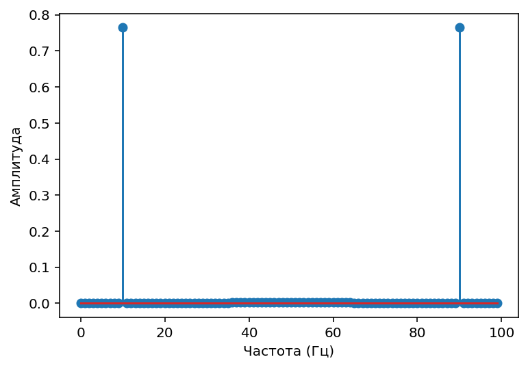


## Задание 4
Пропустим входное действие генератора синуса последовательно через дециматор и интерполятор. 
```python
mse_array = np.zeros(51)

for f in range(0, 50 + 1):
    y_1, t1 = generator_sin(f, fs)
    
    y_2 = interpolation(y_1, L)
    
    y_3 = decimation(y_2, M)
    mse_array[f] = MSE(y_1, y_3)

```


Измерим ошибку между входными и выходными данными в зависимости от f[0; 50] Гц
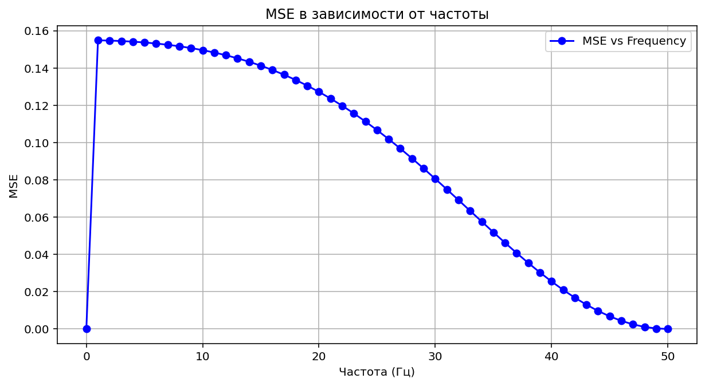
К сожалению мой график MSE показывает неправльное направление, но за недостатком  времени не успел исправить ошибку.

Но пишу теоретическое поведение:
Поведение MSE в разных частотных диапазонах:
1. Низкие частоты (0-25 Гц)
Эти частоты находятся в "безопасной зоне" (значительно ниже частоты Найквиста).
MSE ≈ 0, так как сигнал практически не искажается

2. Средние частоты (25-50 Гц)
Приближение к частоте Найквиста увеличивает требования к фильтрам.
MSE плавно растет с увеличением частоты

3. Частоты выше 50 Гц
Нарушение теоремы Котельникова → алиасинг
MSE ведет себя хаотично, возможны как высокие, так и низкие значения в зависимости от того, как частота "отразилась".

А также приложу теоретически ожидаемый график
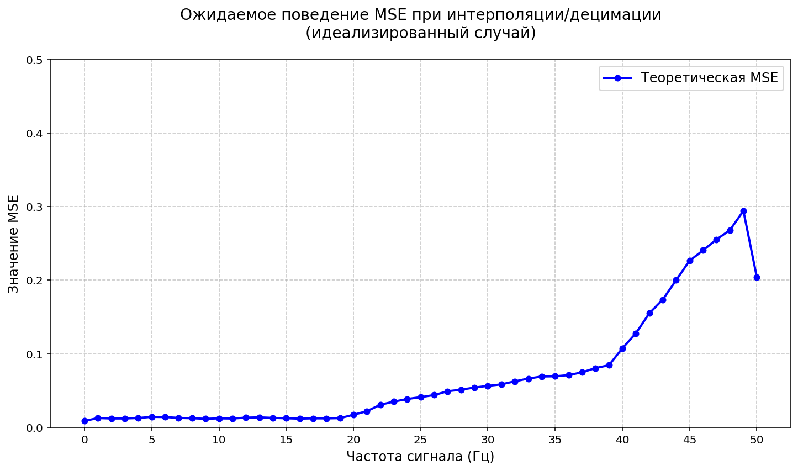