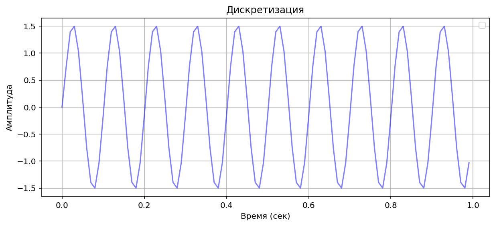
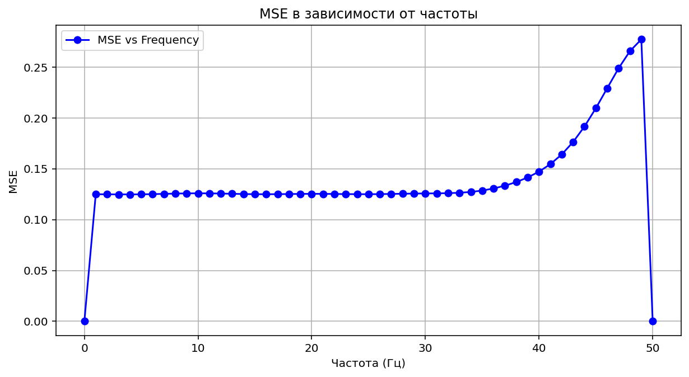

# Тестовое задание - вариант 3


## Задание 1
Генератор синуса на частоте [0; 50]
``` python
def generator_sin(f, fs):
    t_total =  1  # Общее время для отображения 

    t = np.arange(0, t_total, 1/fs)
    y = np.sin(2 * np.pi * f * t)

    return y, t
```

``` python

```
Для примера возьмем частоту f = 10 Гц при частоте дискретизации fs = 100 Гц, по оси времени возьмем 1 сек.  

Посмотрим дискретные значения:

А также посмотрим спектр


## Задание 2 - Интерполяция

Разделим процесс интерполяции на 2 этапа:

1. Введение нулей в исходную последовательность
``` python

def Upsampling(x, L):
    n = len(x)
    m = L*n
    y = np.zeros(m)
    x_i = 0
    for i in range(m):
        if i % L == 0:
            y[i] = x[x_i]
            x_i += 1

    return y
```

результирующий спектр


2.Интерполирующий фильтр
Благодаря цифровому фильтру убираем на сиrнале наложившиеся зеркальные компоненты.
``` python
## Использую Окно Хэмминга чтобы избежать резкого обрезания sinc-функции (# sinc-функция с нормированной частотой среза 1/L)
def Hamming_window(N):
    n = np.arange(N)
    return 0.54 - 0.46 * np.cos(2 * np.pi * n / (N - 1))

def FIR_lowpass(L, N):
    M = (N - 1) // 2
    n = np.arange(-M, M + 1)
    h = np.sinc(n / L)  
    w = Hamming_window(N)
    h = h * w
    h = h / np.sum(h)  # нормируем коэффициенты
    return h

def filtering_signal(x, L):
    # N - длина фильтра
    N = 2 * L * 10 + 1  
    h = FIR_lowpass(L, N)
    return np.convolve(x, h, mode='same')
```

Посмотрим дискретные значения:


Окончательный спектр интерполированной последовательности.
Видим повышение частоты дискретизации


## Задание 3 - Децимация (Понижение частоты дискретизации)
Децимация происходит по аналогии с интерполяцией, только в данном случае мы берем в результирующую сумму лиш каждый M отсчет


Получившийся после прореживания сигнал

Посмотрим дискретные значения:

А также посмотрим спектр (Как видим прежюю частоту 100 Гц)


## Задание 4
Пропустим входное действие генератора синуса последовательно через дециматор и интерполятор. 
```python
mse_array = np.zeros(51)

for f in range(0, 50 + 1):
    y_1, t1 = generator_sin(f, fs)
    
    y_2 = interpolation(y_1, L)
    
    y_3 = decimation(y_2, M)
    mse_array[f] = MSE(y_1, y_3)

```


Измерим ошибку между входными и выходными данными в зависимости от f[0; 50] Гц.
Для проверки данных


Анализ поведения MSE по частотам:
1. Низкие частоты (близко к 0 Гц)
На низких частотах синус меняется медленно.

- Интерполяция и децимация проходят почти без потерь.

- MSE близка к минимальной (примерно 0.125 в твоём массиве), так как сигнал хорошо представляется дискретными точками.

2. Средние частоты (примерно 10–30 Гц)
С ростом частоты синус начинает быстрее меняться.

- Интерполяция и децимация начинают вносить больше ошибок из-за ограничений фильтров.

- MSE постепенно увеличивается, что отражено в твоих данных ростом от ~0.125 до ~0.18.

3. Высокие частоты (близко к 50 Гц)
При приближении к частоте Найквиста (половина частоты дискретизации) ошибки резко растут.

- Могут появляться эффекты наложения спектров (aliasing), если фильтрация недостаточна.

- MSE достигает максимума (в твоём случае около 0.32), что говорит о значительных искажениях